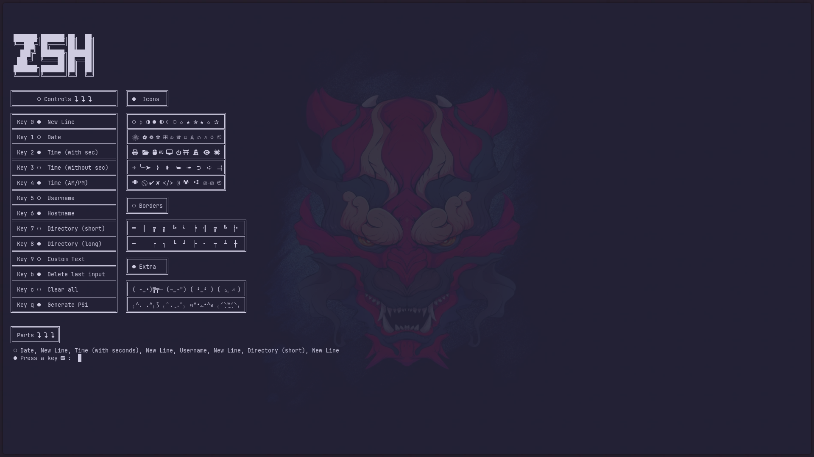

# Simple Bash/Zsh Prompt Generator (TUI)

A small terminal UI (TUI) script that helps you build a custom `PS1` prompt for **Bash** or **Zsh** by pressing single keys.  
It outputs a ready-to-copy `PS1=$'...'` assignment line.

# Screenshots

**Shell selection**  


**Prompt building**  


**Generated output**  


# Features

- Bash & Zsh support
- Add prompt parts with single key presses:
  - New line
  - Date
  - Time (with seconds)
  - Time (without seconds)
  - Time (AM/PM)
  - Username
  - Hostname
  - Directory (short)
  - Directory (long)
  - Custom text
- Edit actions:
  - Delete last input
  - Clear all input
  - Generate final `PS1` line
- Shows a **live list of selected parts**
- Includes a small ASCII/icon “library” for copy/paste

# How the script works 
The script maps keys to the correct string set depending on your shell.

## Bash strings

| Feature              |String |
|----------------------|-------|
| Date                 | `\d`  |
| Time (with seconds)  | `\t`  |
| Time (no seconds)    | `\A`  |
| Time (AM/PM)         | `\@`  |
| Username             | `\u`  |
| Hostname             | `\h`  |
| Directory (short)    | `\W`  |
| Directory (long)     | `\w`  |
| New line             | `\n`  |

## Zsh strings

| Feature              |String |
|----------------------|-------|
| Date                 | `%D`  |
| Time (with seconds)  | `%*`  |
| Time (no seconds)    | `%T`  |
| Time (AM/PM)         | `%@`  |
| Username             | `%n`  |
| Hostname             | `%m`  |
| Directory (short)    | `%1~` |
| Directory (long)     | `%~`  |
| New line             | `\n`  |

# How the TUI works

1. The script asks you to select your shell:
   - `1` = Bash
   - `2` = Zsh
2. You press keys to add parts to the prompt.
3. When you press `q`, the script prints a `PS1=...` line.
4. You copy that line into your shell config file:
   - Bash: `~/.bashrc`
   - Zsh: `~/.zshrc`

# Keyboard Controls 

| Key | Action / Description        |
|-----|-----------------------------|
| `0` | New line                    |
| `1` | Date                        |
| `2` | Time (with seconds)         |
| `3` | Time (no seconds)           |
| `4` | Time (AM/PM)                |
| `5` | Username                    |
| `6` | Hostname                    |
| `7` | Directory (short)           |
| `8` | Directory (long)            |
| `9` | Custom text (literal input) |
| `b` | Delete last input           |
| `c` | Clear all input             |
| `q` | Generate PS1 and exit       |

- Keys `0–8` append a **shell-specific prompt string** (Bash or Zsh).
- Key `9` inserts **literal text** exactly as typed.
- Keys `b` and `c` modify the internal prompt parts list.
- Key `q` finalizes the prompt and prints the `PS1=$'...'` assignment.

# Installation
## 1) Clone the repo
```bash
git clone https://github.com/NT411/Prompt-Generator
```
## 2) Open the folder 
```bash
cd Prompt-Generator
```
## 3 ) Make the script executable
```bash
chmod +x ./ps1gen.sh
```
### 4 ) Run the script
```bash
./ps1gen.sh
```
# Possible TODO in future 
- Add color front and back
- Add blink effect
- Add bold effect 
